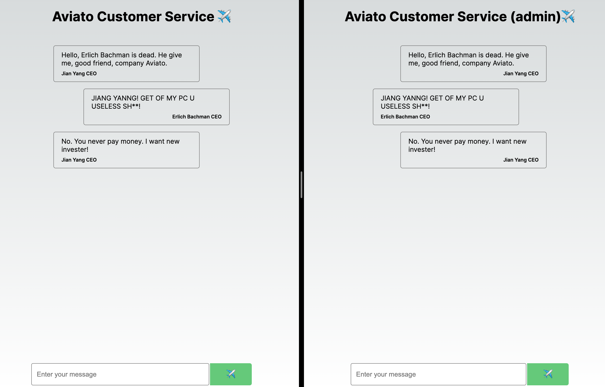

# Aviato Backend

In this exercise you will build the backend for a simple chat application. First 
have a look how the frontend looks like. Everything is implemented already. 
Get yourself familiar with the code and how to run it. (We are using NextJS!)

You can open two browser tabs and visit `http://localhost:3000` and
`http://localhost:3000/admin` to see two different chat clients (note that the
title says `(admin)`). The goal is to implement the backend functionality to
make the chat actually work!

This is how it should look like if those two clients are chatting with each other:



Note, that I simply put two browser tabs next to each other to make the
screenshot. This is NOT a single tab!

## What happens under the hood?

The two clients are actively polling the backend for new messages. For that,
there are 4 endpoints for you to implement:

- `app/api/send/route.js` should be a POST endpoint. This endpoint should save the 
request data somewhere and return back the received request data. The request data
will be in the following JSON format:
```json
{
  "message": "Hello World",
  "senderName": "Some Name"
}
```
We refer to this as a **chat message**! Hence, this endpoint received a **chat message** 
in JSON, stores it and returns it to the sender! We call this endpoint every time a 
user hits the send button.

- `app/api/log/route.js` should be a GET endpoint. This endpoint should simply return 
all stored chat messages! For example, if you refresh the page, you would want your 
messages to be displayed again and not get lost. This is where we need this endpoint!

- `app/api/newmsg?id=<name>` should be a GET endpoint. This endpoint should return 
all new messages for a specific senderName since the last time it was invoked.
Remember that the frontend is polling the backend for new messages in sepecific
intervals. For example, assume the following

```
Erlich Bachman sends 'JIAN YANGG!!' 
Jian Yang's Browser polls api/newmsg?id=Jian Yang CEO
Jian Yang sends 'Yes this is Jian Yang'
Erlich Bachman sends 'where are you?!!'
Erlich Bachman sends 'WHERE IS MY GREEK YOGURT??'
Jian Yang's Browser polls api/newmsg?id=Jian Yang CEO
```

Then, at the first poll the endpoint should return a JSON object as follows:

```
{
"msg" : [{message: "JIAN YANGG!!", senderName: "Erlich Bachman CEO"}]
}
```

and at the second poll the endpoint should return a JSON object as follows:

```
{
"msg" : [
  {message: "where are you?!!", senderName: "Erlich Bachman CEO"},
  {message: "WHERE IS MY GREEK YOGURT??", senderName: "Erlich Bachman CEO"},
]
}
```

Notice, how we only deliver the latest messages since the last poll and we only
include the messages of the other party! Similarly, this should also work
analogously for Erlich's Browser (he should only get Jian Yangs new messages
since his last poll)!

Note that the values in `"msg": [...]` actually simply contains our chat messages
we get from the send endpoint! Also we can get the name from `id=<name>` to
know what messages we should return!

- `app/api/solution/route` should be a GET endpoint. Simply replace your email 
there. We only use this to generate your solution token!


## Final Words

For sake of simplicity, you don't need to use any database or anything. You may 
for example simply store the chat messages in a global variable! 

Also you can assume that there will always only be two chat users "Erlich Bachman CEO" 
and "Jian Yang CEO" for `senderName`.

*The script is probably not perfect, so if you think you have the correct
solution but the script does not recognize it, please join our next session and
discuss your solution with us! As always, if you have trouble with the task,
join our next session and we will help you!*
