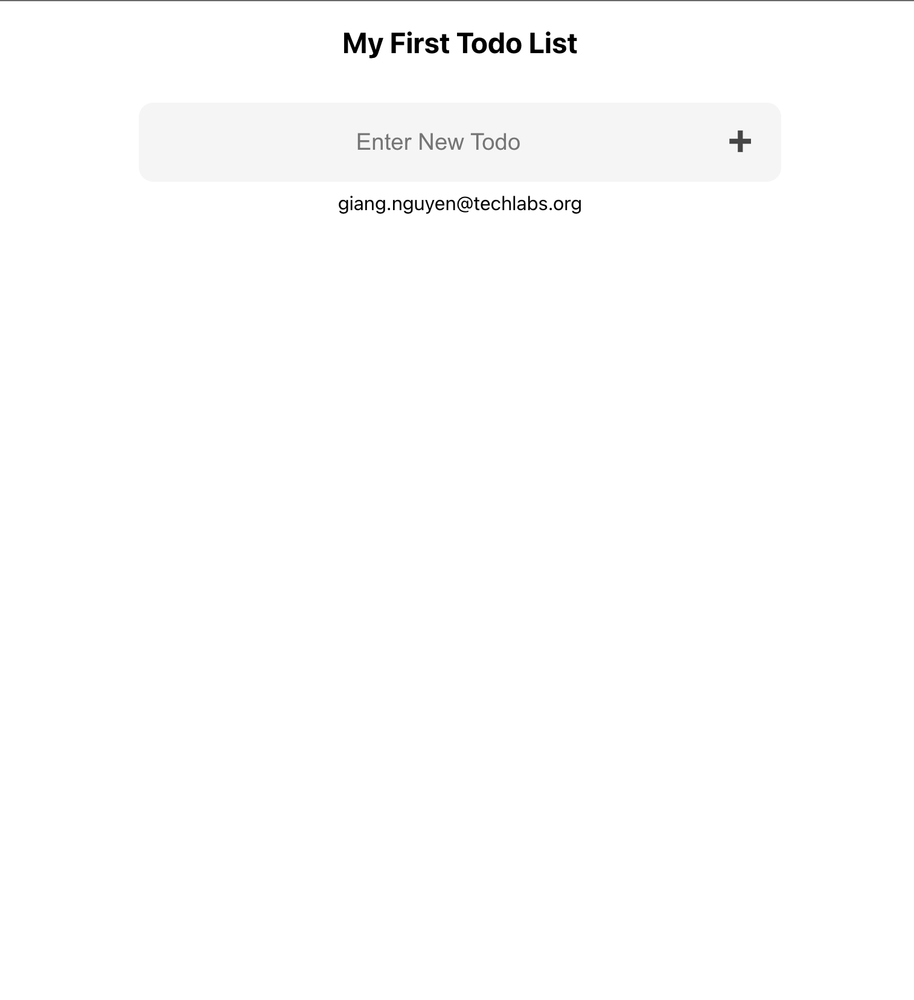
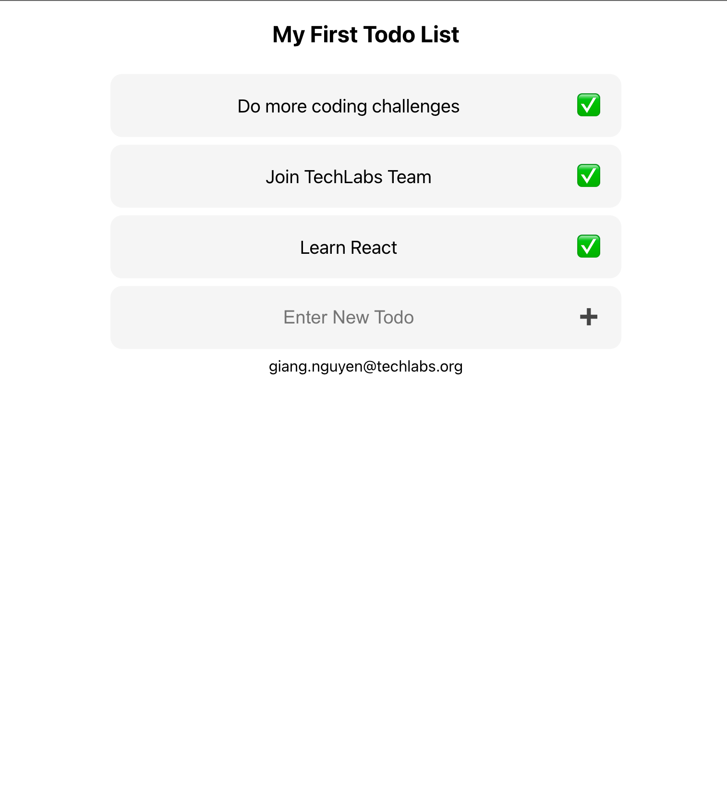
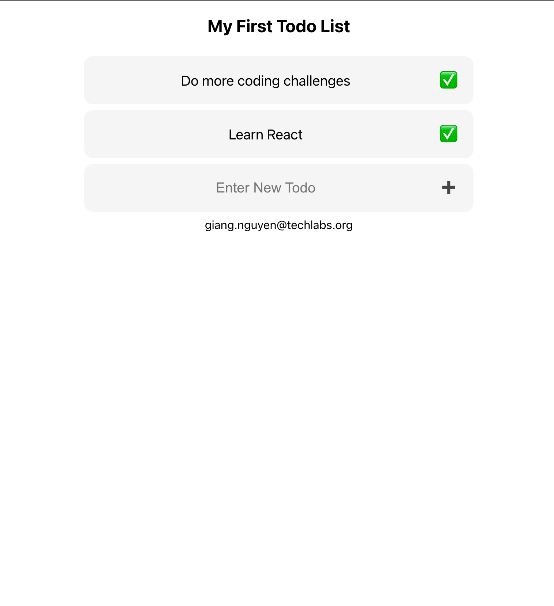

# React Todo

Welcome to another Coding challenge. For this challenge, we will be building a
todo app using React. The goal of this challenge is to get you familiar with
React and how to use it to build a simple app.

## Todo app

First, let's have a look on what blank todo app looks like:

Users should be able to Enter Todos Text in a field and click the ➕ to add new todos
to the list. Here I added three todos:

Once the user decide that a todo item is done, they should click the checkbox
✅ to remove it from the list. In my example, I clicked the checkbox for
`Joining TechLabs Team`

Notice how the item disappeared from the list. However, the rest of the list
still remains intact!

That's it for functionality. Now it's your turn to build it!

## A few Notes on how we test

For our test to work, you must assign some attributes to the HTML elements!

- The input field to enter a new todo should have the attribute `data-testid="eval-input-field"`
- The button to add a new todo should have the attribute `data-testid="eval-add-todo-button"`
- The Button to remove a todo should have the attribute
`data-testid="eval-item-done-<TODO>"` where `<TODO>` is the actual text used in
the todo (without the `<>`)
- you should keep the element where you display your email. We need it to generate your key!
 

That's it! Our script will pretend to use your app and test it if it works. Note that we 
check for functionality not styling. Hence, you can be creative with styling your app!

*The script is probably not perfect, so if you think you have the correct
solution but the script does not recognize it, please join our next session and
discuss your solution with us! As always, if you have trouble with the task,
join our next session and we will help you!*

